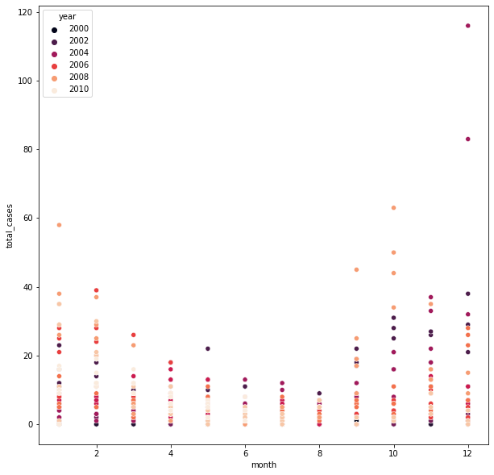
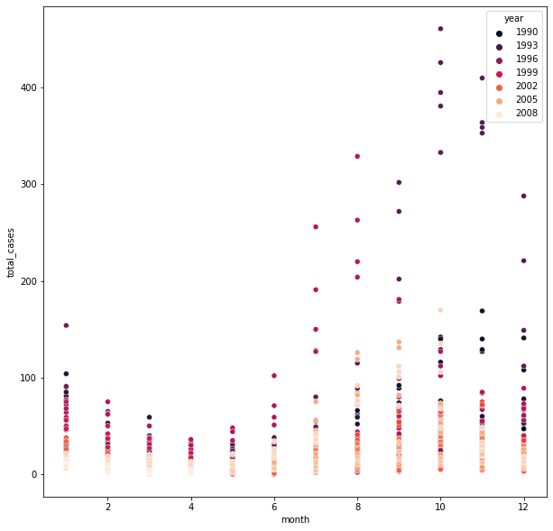

# DengAI-Predicting-Disease-Spread

# Problem description
Goal:-
The Goal of Project is to build a model that can predict dengue cases in a given week of a year for city of San Juan and Iquitos.
# Inspiration:-
Dengue fever is a mosquito-borne disease that occurs in tropical and sub-tropical parts of the world. In mild cases, symptoms are similar to the flu: fever, rash, and muscle and joint pain. In severe cases, dengue fever can cause severe bleeding, low blood pressure, and even death.

Because it is carried by mosquitoes, the transmission dynamics of dengue are related to climate variables such as temperature and precipitation. Although the relationship to climate is complex, a growing number of scientists argue that climate change is likely to produce distributional shifts that will have significant public health implications worldwide.

In recent years dengue fever has been spreading. Historically, the disease has been most prevalent in Southeast Asia and the Pacific islands. These days many of the nearly half billion cases per year are occurring in Latin America

# Dataset Information
Following are the features in the datatset on  (year, weekofyear) timescale:

(Where appropriate, units are provided as a _unit suffix on the feature name.)
## City and date indicators
* city – City abbreviations: sj for San Juan and iq for Iquitos
* week_start_date – Date given in yyyy-mm-dd format
* NOAA's GHCN daily climate data weather station measurements
* station_max_temp_c – Maximum temperature
* station_min_temp_c – Minimum temperature
* station_avg_temp_c – Average temperature
* station_precip_mm – Total precipitation
* station_diur_temp_rng_c – Diurnal temperature range
* PERSIANN satellite precipitation measurements (0.25x0.25 degree scale)
* precipitation_amt_mm – Total precipitation
* NOAA's NCEP Climate Forecast System Reanalysis measurements (0.5x0.5 degree scale)
* reanalysis_sat_precip_amt_mm – Total precipitation
* reanalysis_dew_point_temp_k – Mean dew point temperature
* reanalysis_air_temp_k – Mean air temperature
* reanalysis_relative_humidity_percent – Mean relative humidity
* reanalysis_specific_humidity_g_per_kg – Mean specific humidity
* reanalysis_precip_amt_kg_per_m2 – Total precipitation
* reanalysis_max_air_temp_k – Maximum air temperature
* reanalysis_min_air_temp_k – Minimum air temperature
* reanalysis_avg_temp_k – Average air temperature
* reanalysis_tdtr_k – Diurnal temperature range
* Satellite vegetation - Normalized difference vegetation index (NDVI) - NOAA's CDR Normalized Difference Vegetation Index (0.5x0.5 degree scale) measurements
* ndvi_se – Pixel southeast of city centroid
* ndvi_sw – Pixel southwest of city centroid
* ndvi_ne – Pixel northeast of city centroid
* ndvi_nw – Pixel northwest of city centroid

# Performance metric
Performance is evaluated according to the mean absolute error.

# EDA:-
The total cases in a month for year=[1990,1993,1996,1999,2002,2005,2008] are plotted for cities of  San Juan and Iquitos
### SanJuan

### Iquitos


# Preprocessing
* Handled Missing Values using Linear Interpolation for both the Models.
## Model 1 Preprocessing:-
* Converted the Temperatures from Kelvin to Celsius scale.
* Added Seasons variable which contains values:-[Summer,Fall,Spring,Winter] to capture seasonal trends in the data.
* Normalized the Numerical features using StandardScaler and used One-Hot Encoding to encode Categorical features.
## Model 2 Preprocessing:-
* Normalized the Numerical features using StandardScaler and used One-Hot Encoding to encode Categorical features.
* Converted the data using fixed window method as we do for Sequence models like:- LSTMS,GRU;s

# Model 1
Model-1 consists of simple ANN model trained with mean_absolute_error loss function and adam optimizer
Used ReduceonPlateau technique to reduce learning rate.
Model was trained for 1000 epochs for batcsize=32
```
Model1 is as below
model = Sequential()
model.add(Dense(6, input_dim=len(X_train.keys()), activation='relu'))
model.add(Dropout(0.8))
model.add(Dense(1))
model.compile(loss='mean_absolute_error', optimizer='adam')
```
# Model 2
In Model 2 I prepared data as it is prepared for LSTM network and instead of LSTM I passed it through some dense layers with BatchNormalization and Dropout layer added to prevent Overfitting.Model was trained for 8 epochs with batchsize=16
```
model = tf.keras.Sequential([
    tf.keras.layers.Input(shape=input_shape),
    tf.keras.layers.Dense(nodes, activation='selu'),
    tf.keras.layers.BatchNormalization(),
    tf.keras.layers.Dropout(0.5),
    tf.keras.layers.Dense(nodes/2, activation='selu'),
    tf.keras.layers.Dropout(0.5),
    tf.keras.layers.Dense(1)
  ])
model.compile(loss='mae',
                optimizer=optimizer,
                metrics=['mae', 'mse'])
```
# Results
Model-1 acheived MAE=20.01 
Model-2 achieved MAE=18.47

# Competition Link
The Project is based on competition hosted by Driven data
No of Competitors =11330
## Model 1 gave me Rank of 201
## Model 2 gave me Rank of 150
https://www.drivendata.org/competitions/44/dengai-predicting-disease-spread/
